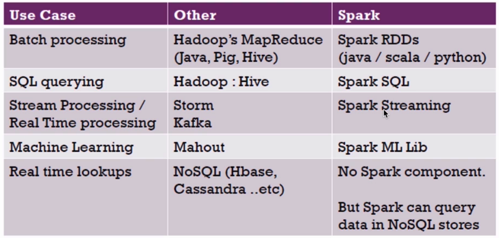
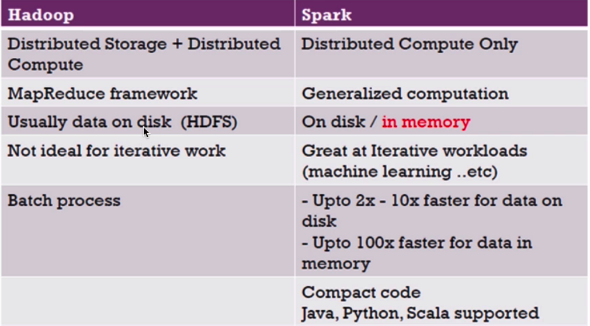
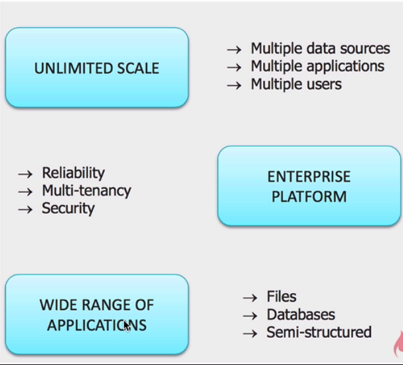
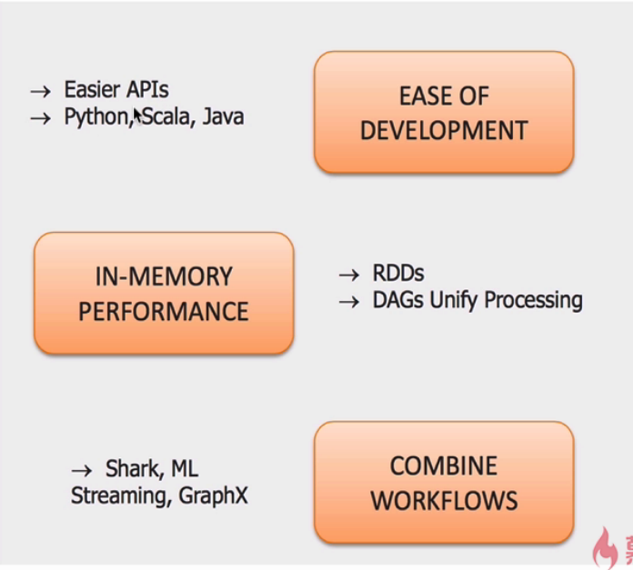
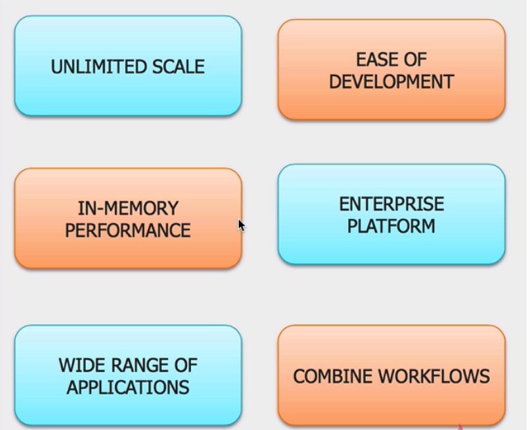
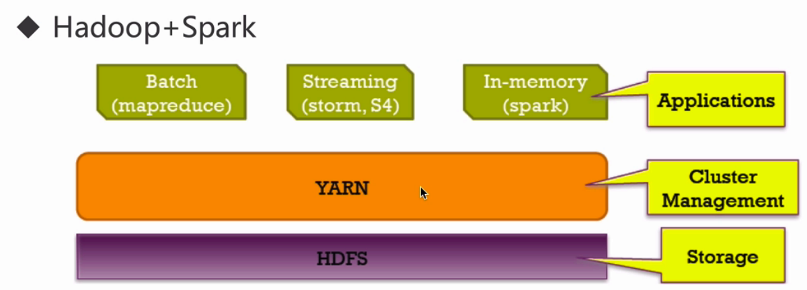

# Spark_WordCount
Spark WordCount Example in Different Spark Modes


# Spark

```
val sparkConf = new SparkConf().setMaster("local[*]").setAppName("SparkWordCountApp")//local mode
val sc = new SparkContext(sparkConf)
```

## What is SparkConf and SparkContext

Sparkconf is the class which gives you the various option to provide configuration parameters.

Sparkcontext is the entry point for spark environment. For every sparkapp you need to create the sparkcontext object. In spark 2 you can use sparksession instead of sparkcontext.

SparkSession is the entry point into all functionality in Spark is the SparkSession class. To create a basic SparkSession, just use SparkSession.builder():

For implicit conversions like converting RDDs to DataFrames
```
import spark.implicits._
```

setMaster and setAppName are the two properties that must be configured

```
import org.apache.spark.{SparkConf, SparkContext}

val conf = new SparkConf()
             .setMaster("local[2]")
             .setAppName("SparkWordCountApp")
val sc = new SparkContext(conf)
val rdd = sc.textFile("file:///Users/xiangluo/Documents/GitHub/Spark_WordCount/data/input.txt")
```

Note that we run with local[2], meaning two threads. 

```
import org.apache.spark.sql.SparkSession

val spark = SparkSession
  .builder()
  .appName("SparkWordCountApp")
  .master("local[*]")
  .getOrCreate()
val rdd = spark.sparkContext.textFile("file:///Users/xiangluo/Documents/GitHub/Spark_WordCount/data/input.txt")

```
local[N] to run locally with N threads. local[*] Run Spark locally with as many worker threads as logical cores on your machine.

## flatmap and map

A map is a transformation operation in Apache Spark. It applies to each element of RDD and it returns the result as new RDD.

A flatMap is a transformation operation. It applies to each element of RDD and it returns the result as new RDD. It is similar to Map, but FlatMap allows returning 0, 1 or more elements from map function. 

map(func) Return a new distributed dataset formed by passing each element of the source through a function func.

flatMap(func) Similar to map, but each input item can be mapped to 0 or more output items (so func should return a Seq rather than a single item).

The transformation function: map: One element in -> one element out. flatMap: One element in -> 0 or more elements out (a collection).


# Maven

## Version
```
    <properties>
        <maven.compiler.source>1.8</maven.compiler.source>
        <maven.compiler.target>1.8</maven.compiler.target>
        <encoding>UTF-8</encoding>
        <scala.tools.version>2.11</scala.tools.version>
        <scala.version>2.11.12</scala.version>
        <spark.version>2.4.5</spark.version>
        <hadoop.version>2.7.7</hadoop.version>
    </properties>
```

## Repository

mavenCentral  http://mvnrepository.com/

```
    <repositories>
        <repository>
            <id>central</id>
            <name>Central Repository</name>
            <url>https://repo.maven.apache.org/maven2</url>
            <layout>default</layout>
            <snapshots>
                <enabled>false</enabled>
            </snapshots>
        </repository>
    </repositories>
```

## groupId, artifactId and version

groupId uniquely identifies your project across all projects. A group ID should follow Java's package name rules. This means it starts with a reversed domain name you control. For example,

org.apache.maven, org.apache.commons

Maven does not enforce this rule. There are many legacy projects that do not follow this convention and instead use single word group IDs. However, it will be difficult to get a new single word group ID approved for inclusion in the Maven Central repository.

You can create as many subgroups as you want. A good way to determine the granularity of the groupId is to use the project structure. That is, if the current project is a multiple module project, it should append a new identifier to the parent's groupId. For example,

org.apache.maven, org.apache.maven.plugins, org.apache.maven.reporting

artifactId is the name of the jar without version. If you created it, then you can choose whatever name you want with lowercase letters and no strange symbols. If it's a third party jar, you have to take the name of the jar as it's distributed.
eg. maven, commons-math

version if you distribute it, then you can choose any typical version with numbers and dots (1.0, 1.1, 1.0.1, ...). Don't use dates as they are usually associated with SNAPSHOT (nightly) builds. If it's a third party artifact, you have to use their version number whatever it is, and as strange as it can look. For example,
2.0, 2.0.1, 1.3.1

# Java's package name rules

Naming Conventions
Package names are written in all lower case to avoid conflict with the names of classes or interfaces.

Companies use their reversed Internet domain name to begin their package names—for example, com.example.mypackage for a package named mypackage created by a programmer at example.com.

Name collisions that occur within a single company need to be handled by convention within that company, perhaps by including the region or the project name after the company name (for example, com.example.region.mypackage).

Packages in the Java language itself begin with java. or javax.

In some cases, the internet domain name may not be a valid package name. This can occur if the domain name contains a hyphen or other special character, if the package name begins with a digit or other character that is illegal to use as the beginning of a Java name, or if the package name contains a reserved Java keyword, such as "int". In this event, the suggested convention is to add an underscore. For example:

| Domain Name  | Package Name Prefix |
| ------------- | ------------- |
| hyphenated-name.example.org	| org.example.hyphenated_name  |

# Spark WordCount Example

Input: File 

Requirement: Count the frequence of each word in the file

Output: File

# Example in Spark-Shell local
```
xiangluo@Xiangs-MacBook-Pro spark-2.4.5-bin-hadoop2.7 % spark-shell --master local
20/05/07 03:18:19 WARN Utils: Your hostname, Xiangs-MacBook-Pro.local resolves to a loopback address: 127.0.0.1; using 192.168.0.101 instead (on interface en0)
20/05/07 03:18:19 WARN Utils: Set SPARK_LOCAL_IP if you need to bind to another address
20/05/07 03:18:19 WARN NativeCodeLoader: Unable to load native-hadoop library for your platform... using builtin-java classes where applicable
Using Spark's default log4j profile: org/apache/spark/log4j-defaults.properties
Setting default log level to "WARN".
To adjust logging level use sc.setLogLevel(newLevel). For SparkR, use setLogLevel(newLevel).
Spark context Web UI available at http://192.168.0.101:4040
Spark context available as 'sc' (master = local, app id = local-1588846705608).
Spark session available as 'spark'.
Welcome to
      ____              __
     / __/__  ___ _____/ /__
    _\ \/ _ \/ _ `/ __/  '_/
   /___/ .__/\_,_/_/ /_/\_\   version 2.4.5
      /_/
         
Using Scala version 2.11.12 (Java HotSpot(TM) 64-Bit Server VM, Java 1.8.0_241)
Type in expressions to have them evaluated.
Type :help for more information.

scala> val rdd = sc.textFile("file:///Users/xiangluo/data/input.txt")
rdd: org.apache.spark.rdd.RDD[String] = file:///Users/xiangluo/data/input.txt MapPartitionsRDD[1] at textFile at <console>:24

scala> rdd.collect()
res0: Array[String] = Array(hello,spark,hadoop, ppl,hello,spark, hadoop)

scala> rdd.flatmap(_.split(",")).map(word => (word,1)).reduceByKey(_+_)
<console>:26: error: value flatmap is not a member of org.apache.spark.rdd.RDD[String]
       rdd.flatmap(_.split(",")).map(word => (word,1)).reduceByKey(_+_)
           ^

scala> rdd.flatMap(_.split(",")).map(word => (word,1)).reduceByKey(_+_)
res2: org.apache.spark.rdd.RDD[(String, Int)] = ShuffledRDD[4] at reduceByKey at <console>:26

scala> res2.collect()
res3: Array[(String, Int)] = Array((spark,2), (hadoop,2), (hello,2), (ppl,1))

scala> rdd.flatMap(_.split(",")).map(word => (word,1)).reduceByKey(_+_).map(x => (x._2,x._1)).sortByKey(false).map(x => (x._2,x._1)).collect()
res4: Array[(String, Int)] = Array((spark,2), (hadoop,2), (hello,2), (ppl,1))
```

# Example in Spark-Submit local

If we want to use spark-submit in local mode, we need to comment 
```
setMaster("local[*]").setAppName("SparkWordCountApp")
```

Because these configurations are passed by means of parameters


Build a jar file with Maven

```
$ mvn package
```

Launching Applications with spark-submit

Some of the commonly used options are:
```
--class: The entry point for your application (e.g. org.apache.spark.examples.SparkPi)
--master: The master URL for the cluster (e.g. spark://23.195.26.187:7077)
--deploy-mode: Whether to deploy your driver on the worker nodes (cluster) or locally as an external client (client) (default: client) †
--conf: Arbitrary Spark configuration property in key=value format. For values that contain spaces wrap “key=value” in quotes (as shown).
application-jar: Path to a bundled jar including your application and all dependencies. The URL must be globally visible inside of your cluster, for instance, an hdfs:// path or a file:// path that is present on all nodes.
application-arguments: Arguments passed to the main method of your main class, if any
```

```
spark-submit \
--class com.louis.bigdata.SparkWordCountAppV2 \
--master local \
/Users/xiangluo/Documents/GitHub/Spark_WordCount/target/sparkwordcount-1.0.jar \
file:///Users/xiangluo/data/input.txt file:///Users/xiangluo/data/out
```

# Example Submitted with Yarn mode

Ensure that HADOOP_CONF_DIR or YARN_CONF_DIR points to the directory which contains the (client side) configuration files for the Hadoop cluster.

```
export HADOOP_CONF_DIR=/Users/xiangluo/app/hadoop-2.7.7/etc/hadoop
```

Upload the data to hdfs
```
hadoop fs -put input.txt /data/input/
```
Submit the Spark job
```
spark-submit \
--class com.louis.bigdata.SparkWordCountAppV2 \
--master yarn \
--name SparkWordCountAppV2 \
--driver-memory 4g \
--executor-memory 2g \
--executor-cores 1 \
/Users/xiangluo/Documents/GitHub/Spark_WordCount/target/sparkwordcount-1.0.jar \
hdfs://localhost:9000/data/input/input.txt hdfs://localhost:9000/data/out
```

Print the result
```
hadoop fs -text '/data/out/part*'
```

# Example Submitted with Standalone mode

```
$ cp slaves.template slaves
```

localhost

```
$ cp spark-env.sh.template spark-env.sh
```

SPARK_MASTER_HOST=localhost

```
$ ./sbin/start-all.sh
```
JPS: master worker


Submit the Spark job
```
spark-submit \
--class com.louis.bigdata.SparkWordCountAppV2 \
--master spark://localhost:7077 \
--name SparkWordCountAppV2 \
--driver-memory 4g \
--executor-memory 2g \
--executor-cores 1 \
/Users/xiangluo/Documents/GitHub/Spark_WordCount/target/sparkwordcount-1.0.jar \
hdfs://localhost:9000/data/input/input.txt hdfs://localhost:9000/data/out2
```

Print the result
```
hadoop fs -text "/data/out2/par*"
```


# Hadoop VS Spark







